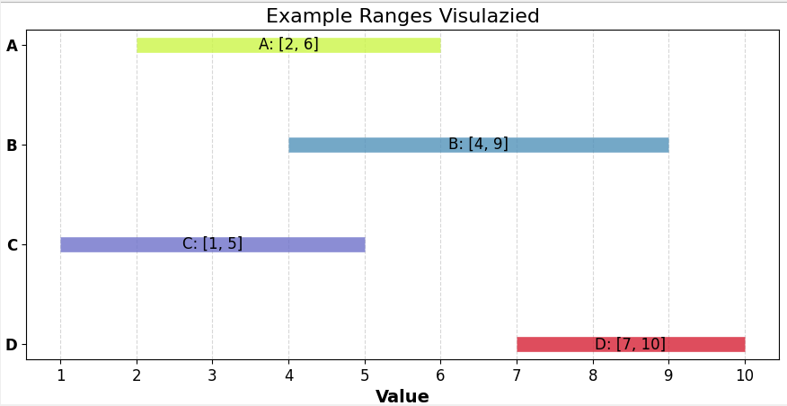
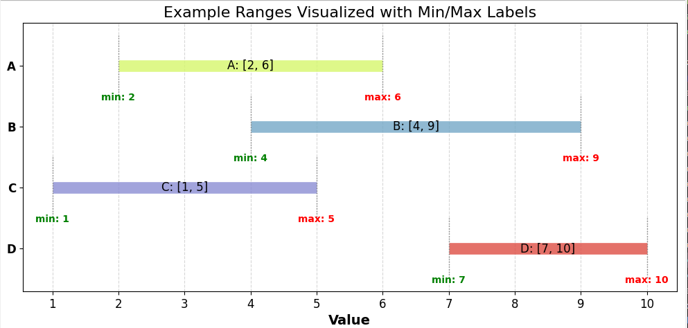
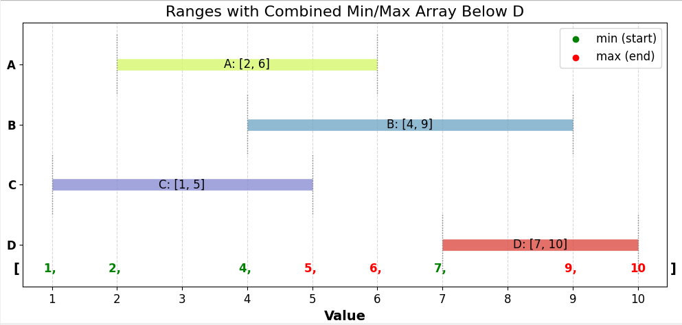
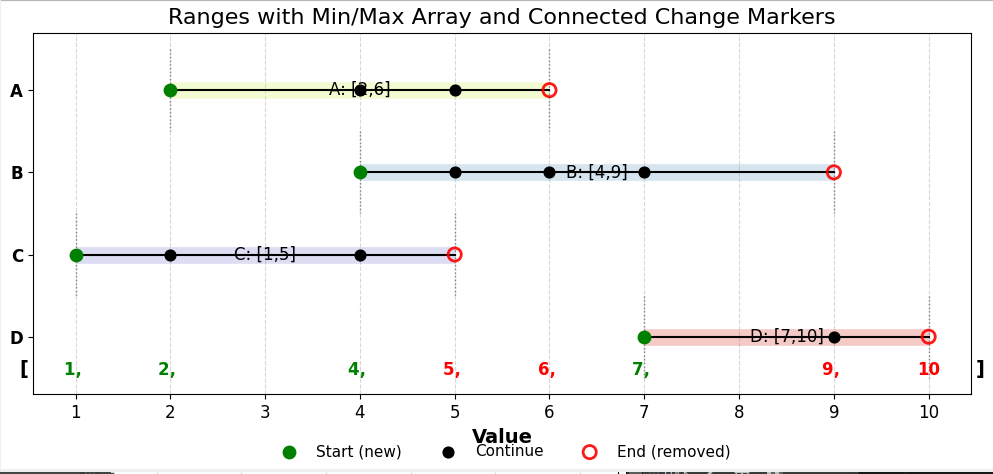
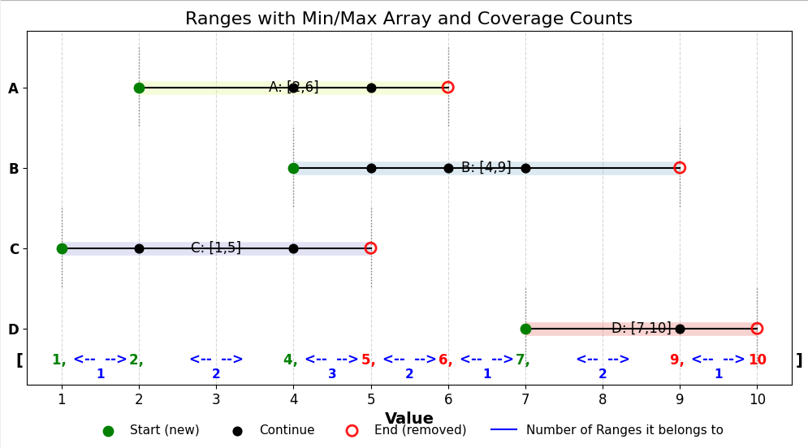
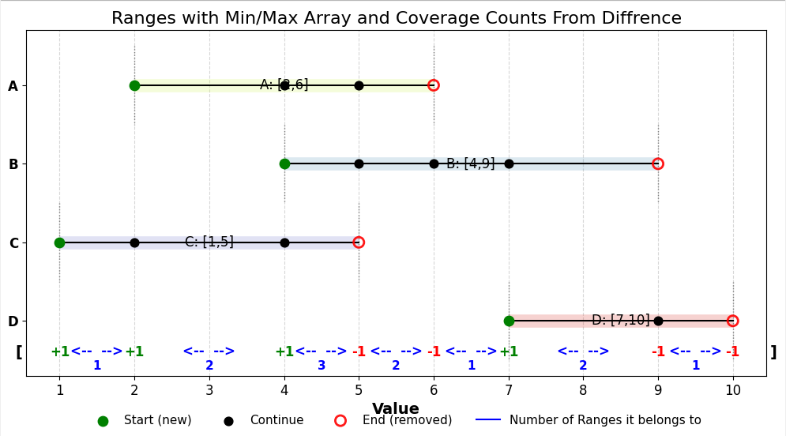
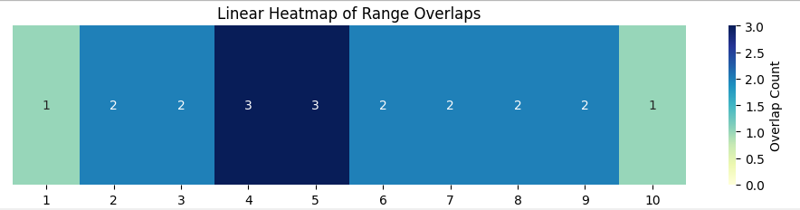

# 📝 Approach Documentation: Most Probable Distance from Ranges

> **Disclaimer:** This document explains the approach we used.  
> If you’re reading this, try solving the problem yourself *before* looking at the details below!  

> [!NOTE]
> This algorith *(in code)* is available in the file `OptimalProblem/mapping_algorithm.py`, in the function `best_distance_from_ranges()`
---

## 1. Overview of the Approach
- Counting the number of overlapping ranges,
- By looking only at each given min and max values, instead of the traditional way of plotting heatmaps.

---

## 2. Step-by-Step Plan
1. **Preprocessing:**  
   - Organising the **events** (both min & max) of ranges in **ascending order**, basically in the order of the *number line*.

2. **Core Algorithm / Method:**  
   - The idea is: when a range **starts (min)**, the number of ranges that a number (or interval) belongs to **increases by 1**.  
   - Similarly, when a range **ends (max)**, the number of ranges that it belongs to **decreases by 1**.

3. **Data Structures:** *(only to code the algorithm)*  
   - **Input**: 
     - List with tuples: `[(d_min1, d_max1), ..., (d_minN, d_maxN)]`
   - **Output**: 
     - Tuple: `(best_d_min, best_d_max)`  
     - Where `best_d_min` and `best_d_max` are the min & max of the interval/segment that is the most common in all of the given ranges.

---

## 3. Implementation Notes
- **Assumptions**
  - Each range satisfies `d_min ≤ d_max`.
  - Ranges are **closed intervals** unless otherwise stated.
  - Equal endpoints are allowed (zero-length ranges are okay).
- **Performance**
  - Sorting all event points is `O(n log n)`.
  - Processing events in order is `O(n)`.
  - Overall complexity: `O(n log n)`.

### ⏱ Time Complexity Note
- The **sorting of all min/max points** takes `O(n log n)`.  
- The **linear computation** afterward adds `O(n)`.  
- Therefore, overall complexity: **`O(n log n)`**.  

---

## 4. Visualization of Steps

## Example  
Imagine these ranges:  

- Range A: `[2, 6]`  
- Range B: `[4, 9]`  
- Range C: `[1, 5]`  
- Range D: `[7, 10]`  

## Processing data
- If we mark all the min *(starts)* and max *(ends)*

  

- And then sort all of the events *(min & max)* in **ascending order**

  

- With min as *green* and max as *red*.
- Now let’s mark the **events** happening at each point

  

- Now let’s count the **overlaps/coverage** in each *segment*:

  

- Notice that the count of overlap **increases** each time after **green** (start),  
  and **decreases** each time after **red** (end).
- So, if we mark each **green** in the array with **+1** and each **red** with **-1**:

  

- Adding these event changes cumulatively gives the **overlap count** for each segment.  
- This count is exactly the **number of ranges** that the segment belongs to.  
- Also, this example gives us the plot
    
> *Therefore*, the segment where the **maximum number of ranges** pass through can be found with this algorithm.  
> Which is so cool! :)

---

## 5. Expected Outcome
- **Type of output:** the interval (or point) of maximum overlap - i.e., the **most probable distance**.  
- **Concrete example:** for the example above, the interval **[4, 5]** is covered by 3 ranges, so that’s the most probable distance.

---

## 6. Future Enhancements
- Handle **ties** cleanly when multiple intervals share the same maximum overlap.
- Support **weighted ranges** (some ranges could count more than others).