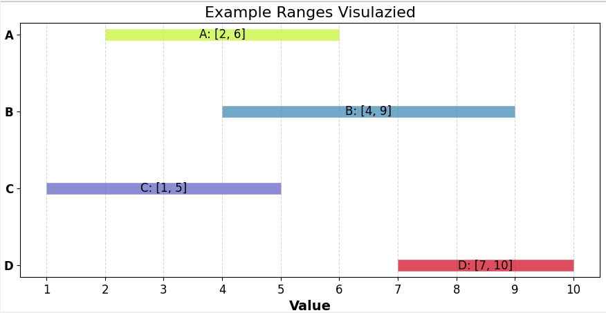

# 📏 Problem: Finding the Most Probable Distance from Ranges  

## The Setup  
You have many ranges of values, each defined by a **minimum** and **maximum** (like `[d_min, d_max]`).  
The challenge is to determine which **single distance (or interval)** is most likely, i.e., where the **most ranges overlap**.  

---

## Example  
Imagine these ranges:  

- Range A: `[2, 6]`  
- Range B: `[4, 9]`  
- Range C: `[1, 5]`  
- Range D: `[7, 10]`  

When these ranges are plotted (stacked as intervals), you can visually see where they overlap.  

---

## Formal Problem Statement  
**Input:**  
- A list of ranges, each represented as `(d_min, d_max)`.  

**Output:**  
- The point (or interval) that lies inside the **maximum number of ranges**.  

**Goal:**  
Find the "most probable distance" by identifying the region with the highest overlap.  

